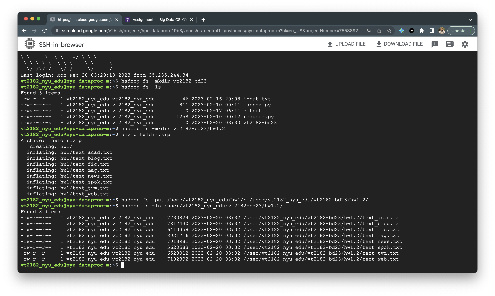
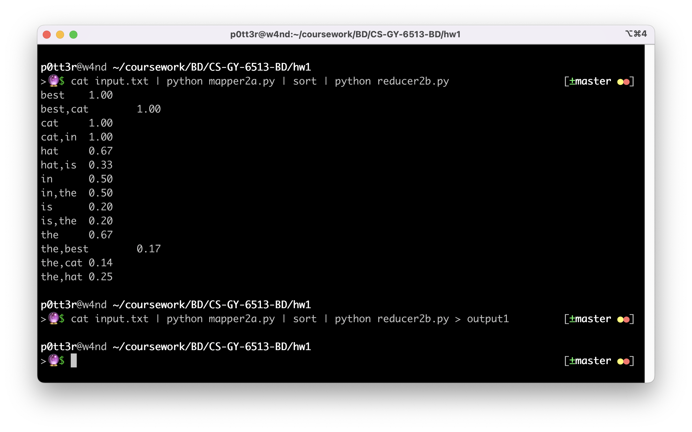
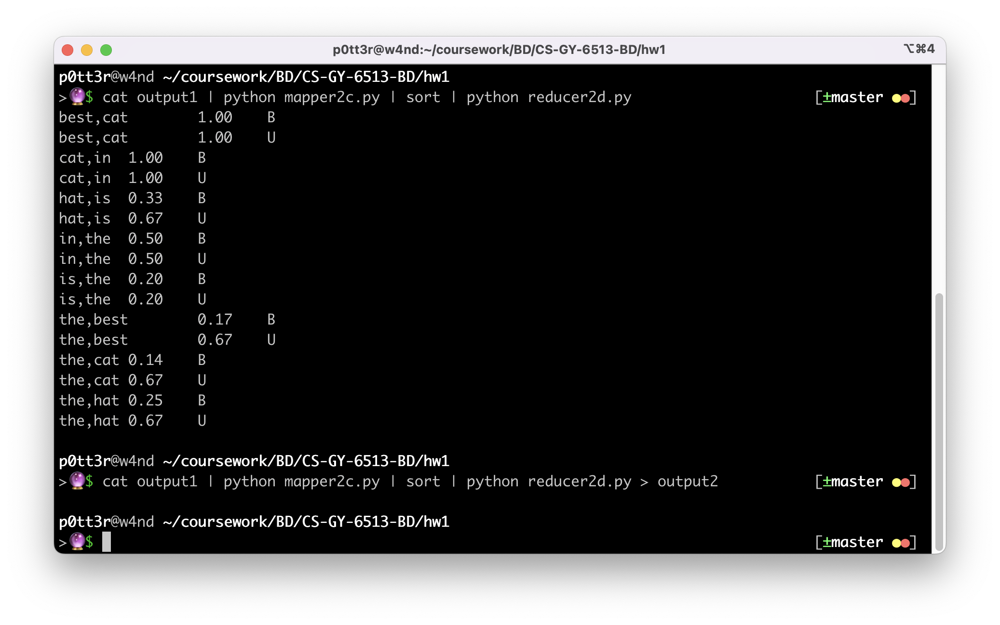
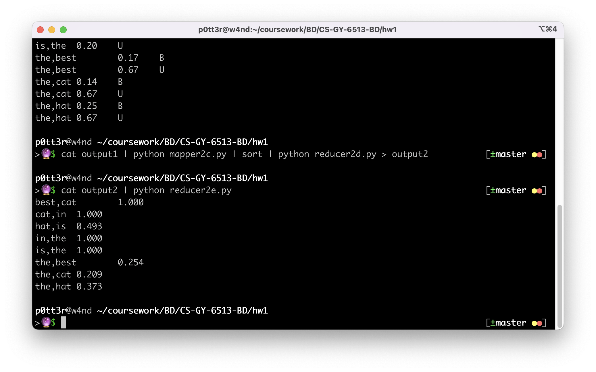

# Homework 1

## Problem 1: HDFS

Running any version of Hadoop (HPC Dataproc, docker, AWS, or any), submit screen grabs (a picture in jpg or other suitable format) of the following:

1. create a directory in HDFS with this format: netid-bd23 (e.g. mine will be ‘jcr365-bd23’).
2. Submit a screen grab of the output of a Hadoop file listing showing your home directory and your new directory in it.
3. Create a directory for the homework problem 1.2 (trigram count), and extract all input files into it. Call this directory as follows: hw1.2, e.g. mine will be hw1.2.  Submit a picture of directory listings or otherwise show the input files in it.



## Problem 2: Language Models with MapReduce

Write your own code in your language of choice, but your code MUST be Hadoop MapReduce.
For Python, use Hadoop streaming. Submit the result and code.

Compute the Bigram LM, of the form “word1, word2”, P(word2 | word1)

```
P(w2 | w1)
= P(w1 w2) / P(w1)
= count(w1 w2) * total(bigrams) / count(w1) * total(unigrams)
```

```bash
$ echo "The Cat in the Hat is the best cat in the hat" > input.txt
$ cat input.txt | python mapper2a.py | sort | python reducer2b.py > output1
$ cat output1 | python mapper2c.py | sort | python reducer2d.py > output2
$ cat output2 | python reducer2e.py
best,cat	1.000
cat,in	1.000
hat,is	0.493
in,the	1.000
is,the	1.000
the,best	0.254
the,cat	0.209
the,hat	0.373
```





## Problem 3: Extra Credit

Using the solution of problem 2, find the x below (print the word in this sequence with the highest probability)

united states \_\_\_x\_\_\_

For P( x | united states) = p , find the x with the highest p

Steps:
1. Calculate the unigrams, bigrams and trigrams
2. Calculate the total unigrams, total bigrams and total trigrams
3. Calculate the probability of the unigrams, bigrams and trigrams
4. For calculating `P( x | united states)`, we need to calculate `P(united states x)`, `P(united states)` and `P(x)`
```
P( x | united states) = P(united states x) / P(united states)
```
5. Sort the probabilities and print the word with the highest probability
