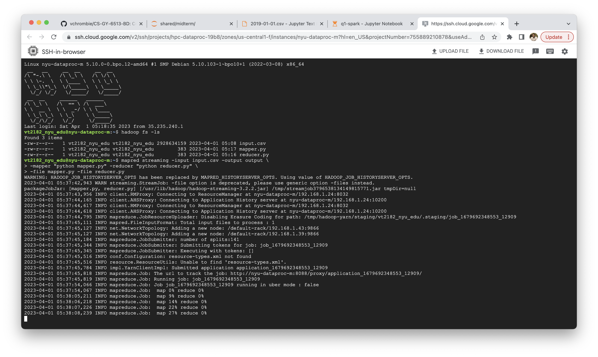
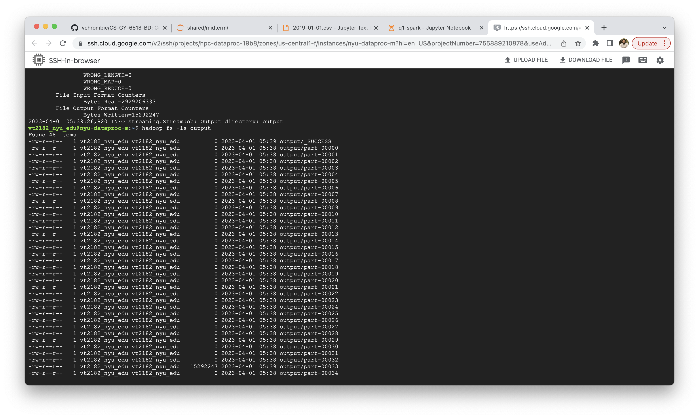

# Random Sampling a data stream

```bash
$ unzip data_Q1_2019.zip
Archive:  data_Q1_2019.zip
   creating: drive_stats_2019_Q1/
  inflating: drive_stats_2019_Q1/2019-01-22.csv  
  inflating: drive_stats_2019_Q1/2019-03-27.csv  

# remove first line from each file since it is the header
$ for file in drive_stats_2019_Q1/*.csv; do tail -n +2 "$file" > "$file.tmp" && mv "$file.tmp" "$file"; done

$ cat drive_stats_2019_Q1/*.csv > input.csv
$ wc -l input.csv
9577046 input.csv

$ hadoop fs -ls

$ hadoop fs -put input.csv
$ hadoop fs -ls
Found 1 items
-rw-r--r--   1 vt2182_nyu_edu vt2182_nyu_edu 2928634159 2023-04-01 05:08 input.csv

$ hadoop fs -put mapper.py
$ hadoop fs -put reducer.py
$ hadoop fs -ls
Found 3 items
-rw-r--r--   1 vt2182_nyu_edu vt2182_nyu_edu 2928634159 2023-04-01 05:08 input.csv
-rw-r--r--   1 vt2182_nyu_edu vt2182_nyu_edu        383 2023-04-01 05:17 mapper.py
-rw-r--r--   1 vt2182_nyu_edu vt2182_nyu_edu        383 2023-04-01 05:16 reducer.py

$ mapred streaming -input input.csv -output output \
    -mapper "python mapper.py" -reducer "python reducer.py" \
    -file mapper.py -file reducer.py

$ hadoop fs -ls output
Found 48 items
-rw-r--r--   1 vt2182_nyu_edu vt2182_nyu_edu          0 2023-04-01 05:22 output/_SUCCESS
-rw-r--r--   1 vt2182_nyu_edu vt2182_nyu_edu          0 2023-04-01 05:21 output/part-00000
-rw-r--r--   1 vt2182_nyu_edu vt2182_nyu_edu          0 2023-04-01 05:21 output/part-00001

$ hadoop fs -cat output/part-* >> output.csv

$ wc -l output.csv 
50000 output.csv
```




